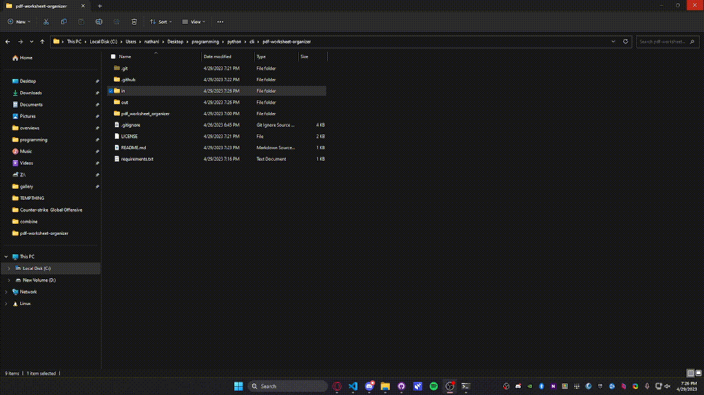

# PDF Worksheet Organizer

> Renumbers PDF worksheet problems so that questions follow a proper order.
> <br/>
> status: MVP

<br/>

[](https://forthebadge.com)
[](https://forthebadge.com)
[](https://forthebadge.com)

## Usage

```python
python -m pdf_worksheet_organizer [INPUT] [OUTPUT]
```

## Demo

